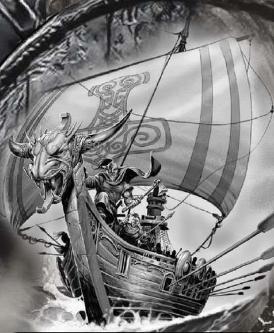
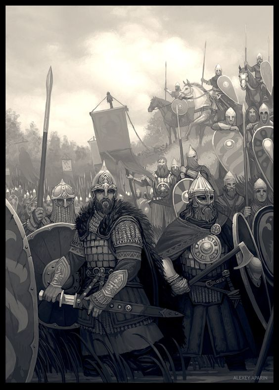
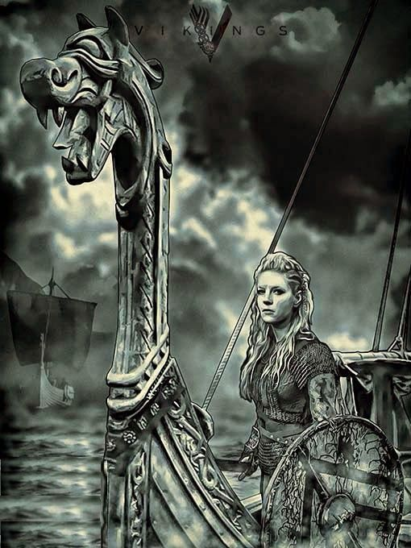
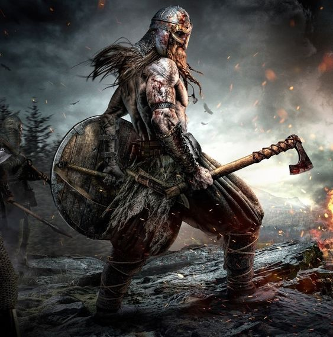
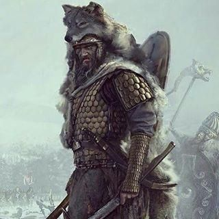
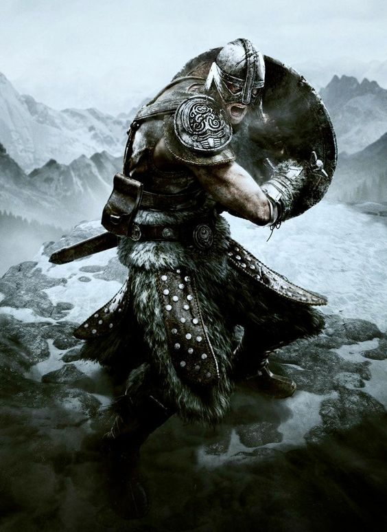
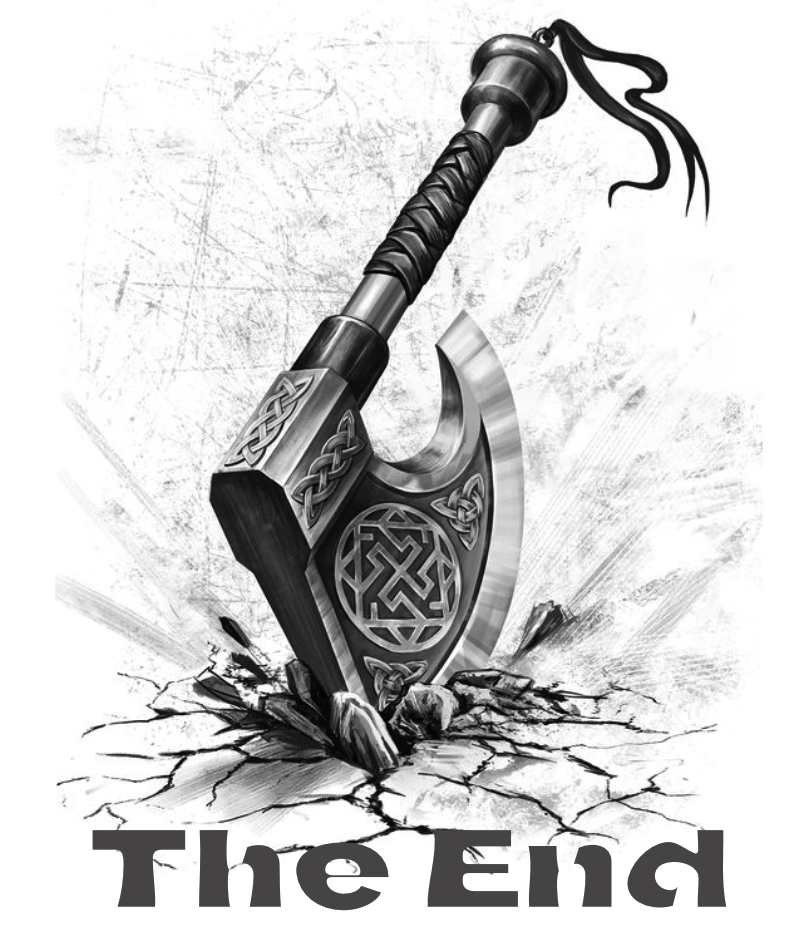
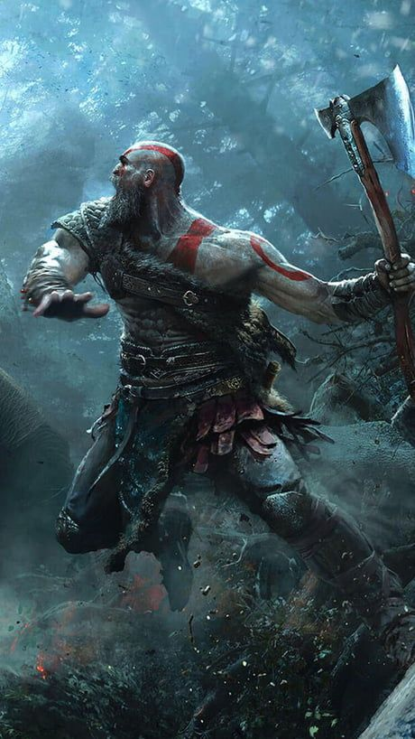

  
  
  
  

  <!-- Typing SVG by DenverCoder1 - https://github.com/DenverCoder1/readme-typing-svg -->
    

  <!-- Typing SVG by DenverCoder1 - https://github.com/DenverCoder1/readme-typing-svg -->
    
    

    

    

  

<h3 align="center">Get ready to relive some childhood memories and have some fun✨✨</h3>

 

# SEA OF BONES

## Table of contents :round_pushpin:
1. [Introduction](#Introduction)
2. [HowToPlay](#HowToPlay)
3. [Rule](#Rule)
4.  [Control](#Control)
5.  [Members](#Members)
6.   [References](#References)

 

## Introduction ☠️: 

"Sea Of Bones" is an updated version of "BattleShip"- a familiar name among game lovers in 1987, with this improved version we have greatly improved the experience for players and also not forgetting to be user-friendly.

Story: The Viking wars at sea, also known as the "Viking wars", were important events in the history of Northern Europe and Europe during the Middle Ages.
The Vikings were a Nordic people who lived in the oceans and coastal regions. They are known to be mercenary sailors capable of moving and attacking anywhere in the sea with their long and flexible boats.
During the Middle Ages, Viking wars at sea spread throughout Europe and North America, attacking settlements, cities, and even merchant ships. They became enemies of many European countries, especially Britain, France and Denmark.
The Viking wars at sea came to an end in the early 11th century after the Norwegian captain Leif Erikson discovered the Americas, and European countries began to transition to the era of imperialism and search for territories. new land at sea.

Mission:
The object of the game is to find the location of the opponent's ships and destroy them by attacking the tiles on the opponent's board.

## How to play ?

After running the game, the interface of the game will be set up. The opening is "Menu" including "Random", "Reset" & "Battle" ". "Random" will help players arrange their boats randomly on the grid or the players can arrange their boat by themself and "Reset" when the players want to rearrange their boats after that player can begin the impossible mission by clicking "Battle". 

## Rule:
In this game, each player has a board with numbered squares and places his ships on this board. Each vessel has a different length and is placed vertically or horizontally on the board. The object of the game is to find the location of the opponent's ships and destroy them by attacking the tiles on the opponent's board.

When a player attacks a tile on the opponent's board, if that tile contains part of a ship, the opponent must report the hit and which part of the ship was destroyed. If all parts of a ship are destroyed, the player will announce the destruction of the ship and gain points.

The game ends when one player destroys all of the opponent's ships.

### Controls:
Left click to choose the mode, place the boat and attack the enemy.

### Damage
| 1 hit/ 1 ship |

# Members:

| Index |         Name          |     ID      |                  Email                  |                       Github                                |                              Position                              |
| :---: | :-------------------: | :---------: |:---------------------------------------:| :---------------------------------------------------------: | :----------------------------------------------------------------: |
|   1   |     Pham Le Duc Thinh | ITDSIU20085 |           pldthinh.ityu@gmail.com       |           [ducthinh17](https://github.com/ducthinh17)       |          Leader                                                    |
|   2   |    Nguyen Thanh Binh  | ITDSIU20056 |          ntbinh.ityu@gmail.com          | [OliverRed1602](https://github.com/OliverRed1602)           |         Member                                                     |
|   3   |    Nguyen Song Hao Kiet    | ITITIU20098 |        ngshaokiet1109@gmail.com               |       [HaoKiet123](https://github.com/HaoKiet123)         |         Member                                                     |
|   4   | Chau Khac Dinh Phong | ITITIU20076 |      zzthekid1412z@gmail.com            |       [dinhphong123](https://github.com/dinhphong123)               |          Member                                                    |

  
# About us:

 🗣 All of my projects are available at [Battle-Ship](https://github.com/ducthinh17/BattleShip-2) 

 💬 Ask me about **Javascript, Java swing, JFrame,...** 

 📫 How to contact us: 

<ul>
  <strong>
  <li>pldthinh.ityu@gmail.com</li>
  <li>Ntbinh.iuswt@gmail.com</li>
  <li>ngshaokiet1109@gmail.com</li>
  <li>zzthekid1412z@gmail.com</li>
  </strong>
</ul>

 📄 Know about old experiences [BattleShip-2](https://github.com/ducthinh17/BattleShip-2) 

 ⚡ Fun fact:  Humor and dynamism are always within us 

<h3 align="left">Connect with us:</h3>

<h3 align="left">Languages and Tools:</h3>

  </a> 

  
  
  

  
  
  

